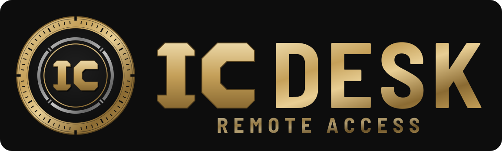

<p align="center">
  <br>
  <a href="#idioma">Idioma</a> •
  <a href="#identidade-visual">Identidade visual</a> •
  <a href="#como-funciona">Como funciona</a> •
  <a href="#como-compilar">Compilar</a> •
  <a href="#sobre-o-upstream-rustdesk">Upstream</a>
</p>

# ICDESK

Software de acesso e controle remoto do **IC TEAM**. Permite usar, ver ou consertar um computador ou celular à distância pela internet.

ICDESK é um fork do [RustDesk](https://github.com/rustdesk/rustdesk) com identidade visual própria, inspirada no emblema do IC TEAM.

## Como funciona

- Cada dispositivo recebe um número de identificação único (ID).
- Para acessar outra máquina, digite o ID no programa.
- O dono do outro aparelho precisa aceitar a conexão para liberar o acesso.
- Funciona em Windows, macOS, Linux, Android e iOS.

## Idioma

A interface abre em **português do Brasil** por padrão. Para trocar, vá em Configurações > Idioma; a escolha fica salva.

- Traduções: [`src/lang/pt_BR.rs`](src/lang/pt_BR.rs) (completo, 780 textos). Nele, "RustDesk" aparece como "ICDESK".
- O padrão é definido em `translate_locale`, em [`src/lang.rs`](src/lang.rs).
- Português de Portugal continua disponível em `src/lang/pt_PT.rs`.

## Identidade visual

Preto como base, dourado como destaque e azul só como acento de conexão. As cores de status são separadas para o dourado nunca ser lido como alerta.

| Cor | Hex | Uso | Token CSS |
|---|---|---|---|
| Rich Black | `#0D0D0D` | Fundo, capa, textos escuros | `--cx-richblack` |
| IC Gold | `#C5A059` | Títulos, filetes, botões, detalhes | `--cx-gold` |
| IC Gold claro | `#E8CE94` | Hover, links, realce do gradiente | `--cx-goldlight` |
| Tech Blue | `#00F0FF` | Acento pontual: sinal de conexão, gráficos | `--cx-techblue` |
| Texto | `#F2F2F2` | Texto sobre fundo escuro | `--cx-text` |
| Status online | `#22C55E` | Online, sucesso | `--cx-ok` |
| Status alerta | `#EAB308` | Backup atrasado, CPU/temperatura alta | `--cx-warn` |
| Status offline | `#EF4444` | Offline, erro | `--cx-offline` |

Gradiente dourado do logo: `#EBD7A6` → `#C5A059` → `#8A6A32`.

- Fonte da verdade das cores: [`brand/tokens.css`](brand/tokens.css). O app Flutter espelha esses valores em [`flutter/lib/brand.dart`](flutter/lib/brand.dart) (`IcBrand`); mantenha os dois iguais.
- Logo, ícones e scripts de geração: [`res/icdesk-brand/`](res/icdesk-brand/README.md). Para regenerar todos os ícones: `python3 res/icdesk-brand/export.py`.
- Tipografia do logo: Barlow Semi Condensed (Google Fonts).

## Como compilar

O processo é o mesmo do RustDesk. Veja [Raw Steps to build](#raw-steps-to-build), [Docker](#how-to-build-with-docker) e o [CI do Flutter](https://github.com/rustdesk/rustdesk/blob/master/.github/workflows/flutter-build.yml).

---

## Sobre o upstream (RustDesk)

O texto abaixo é do README original do RustDesk, mantido por atribuição e porque as instruções de build continuam valendo. O projeto é distribuído sob a licença AGPL-3.0 (ver [LICENCE](LICENCE)).

> [!Caution]
> **Misuse Disclaimer:** <br>
> The developers of RustDesk do not condone or support any unethical or illegal use of this software. Misuse, such as unauthorized access, control or invasion of privacy, is strictly against our guidelines. The authors are not responsible for any misuse of the application.

Chat with us: [Discord](https://discord.gg/nDceKgxnkV) | [Twitter](https://twitter.com/rustdesk) | [Reddit](https://www.reddit.com/r/rustdesk) | [YouTube](https://www.youtube.com/@rustdesk)

[](https://rustdesk.com/pricing.html)

Yet another remote desktop solution, written in Rust. Works out of the box with no configuration required. You have full control of your data, with no concerns about security. You can use our rendezvous/relay server, [set up your own](https://rustdesk.com/server), or [write your own rendezvous/relay server](https://github.com/rustdesk/rustdesk-server-demo).


RustDesk welcomes contribution from everyone. See [CONTRIBUTING.md](docs/CONTRIBUTING.md) for help getting started.

[**FAQ**](https://github.com/rustdesk/rustdesk/wiki/FAQ)

[**BINARY DOWNLOAD**](https://github.com/rustdesk/rustdesk/releases)

[**NIGHTLY BUILD**](https://github.com/rustdesk/rustdesk/releases/tag/nightly)

[](https://f-droid.org/en/packages/com.carriez.flutter_hbb)
[](https://flathub.org/apps/com.rustdesk.RustDesk)

## Dependencies

Desktop versions use Flutter or Sciter (deprecated) for GUI. This tutorial is for Sciter only, since it is easier and more friendly to start. Check out our [CI](https://github.com/rustdesk/rustdesk/blob/master/.github/workflows/flutter-build.yml) for building the Flutter version.

Please download Sciter dynamic library yourself.

[Windows](https://raw.githubusercontent.com/c-smile/sciter-sdk/master/bin.win/x64/sciter.dll) |
[Linux](https://raw.githubusercontent.com/c-smile/sciter-sdk/master/bin.lnx/x64/libsciter-gtk.so) |
[macOS](https://raw.githubusercontent.com/c-smile/sciter-sdk/master/bin.osx/libsciter.dylib)

## Raw Steps to build

- Prepare your Rust development env and C++ build env

- Install [vcpkg](https://github.com/microsoft/vcpkg), and set `VCPKG_ROOT` env variable correctly

  - Windows: vcpkg install libvpx:x64-windows-static libyuv:x64-windows-static opus:x64-windows-static aom:x64-windows-static
  - Linux/macOS: vcpkg install libvpx libyuv opus aom

- run `cargo run`

## [Build](https://rustdesk.com/docs/en/dev/build/)

## How to Build on Linux

### Ubuntu 18 (Debian 10)

```sh
sudo apt install -y zip g++ gcc git curl wget nasm yasm libgtk-3-dev clang libxcb-randr0-dev libxdo-dev \
        libxfixes-dev libxcb-shape0-dev libxcb-xfixes0-dev libasound2-dev libpulse-dev cmake make \
        libclang-dev ninja-build libgstreamer1.0-dev libgstreamer-plugins-base1.0-dev
```

### openSUSE Tumbleweed

```sh
sudo zypper install gcc-c++ git curl wget nasm yasm gcc gtk3-devel clang libxcb-devel libXfixes-devel cmake alsa-lib-devel gstreamer-devel gstreamer-plugins-base-devel xdotool-devel
```

### Fedora 28 (CentOS 8)

```sh
sudo yum -y install gcc-c++ git curl wget nasm yasm gcc gtk3-devel clang libxcb-devel libxdo-devel libXfixes-devel pulseaudio-libs-devel cmake alsa-lib-devel gstreamer1-devel gstreamer1-plugins-base-devel
```

### Arch (Manjaro)

```sh
sudo pacman -Syu --needed unzip git cmake gcc curl wget yasm nasm zip make pkg-config clang gtk3 xdotool libxcb libxfixes alsa-lib pipewire
```

### Install vcpkg

```sh
git clone https://github.com/microsoft/vcpkg
cd vcpkg
git checkout 2023.04.15
cd ..
vcpkg/bootstrap-vcpkg.sh
export VCPKG_ROOT=$HOME/vcpkg
vcpkg/vcpkg install libvpx libyuv opus aom
```

### Fix libvpx (For Fedora)

```sh
cd vcpkg/buildtrees/libvpx/src
cd *
./configure
sed -i 's/CFLAGS+=-I/CFLAGS+=-fPIC -I/g' Makefile
sed -i 's/CXXFLAGS+=-I/CXXFLAGS+=-fPIC -I/g' Makefile
make
cp libvpx.a $HOME/vcpkg/installed/x64-linux/lib/
cd
```

### Build

```sh
curl --proto '=https' --tlsv1.2 -sSf https://sh.rustup.rs | sh
source $HOME/.cargo/env
git clone --recurse-submodules https://github.com/rustdesk/rustdesk
cd rustdesk
mkdir -p target/debug
wget https://raw.githubusercontent.com/c-smile/sciter-sdk/master/bin.lnx/x64/libsciter-gtk.so
mv libsciter-gtk.so target/debug
VCPKG_ROOT=$HOME/vcpkg cargo run
```

## How to build with Docker

Begin by cloning the repository and building the Docker container:

```sh
git clone https://github.com/rustdesk/rustdesk
cd rustdesk
git submodule update --init --recursive
docker build -t "rustdesk-builder" .
```

Then, each time you need to build the application, run the following command:

```sh
docker run --rm -it -v $PWD:/home/user/rustdesk -v rustdesk-git-cache:/home/user/.cargo/git -v rustdesk-registry-cache:/home/user/.cargo/registry -e PUID="$(id -u)" -e PGID="$(id -g)" rustdesk-builder
```

Note that the first build may take longer before dependencies are cached, subsequent builds will be faster. Additionally, if you need to specify different arguments to the build command, you may do so at the end of the command in the `<OPTIONAL-ARGS>` position. For instance, if you wanted to build an optimized release version, you would run the command above followed by `--release`. The resulting executable will be available in the target folder on your system, and can be run with:

```sh
target/debug/rustdesk
```

Or, if you're running a release executable:

```sh
target/release/rustdesk
```

Please ensure that you run these commands from the root of the RustDesk repository, or the application may not find the required resources. Also note that other cargo subcommands such as `install` or `run` are not currently supported via this method as they would install or run the program inside the container instead of the host.

## File Structure

- **[libs/hbb_common](https://github.com/rustdesk/rustdesk/tree/master/libs/hbb_common)**: video codec, config, tcp/udp wrapper, and some other utility functions shared with the server
- **[libs/base](https://github.com/rustdesk/rustdesk/tree/master/libs/base)**: protobuf, fs functions for file transfer, keyboard and platform code used only by this app
- **[libs/scrap](https://github.com/rustdesk/rustdesk/tree/master/libs/scrap)**: screen capture
- **[libs/enigo](https://github.com/rustdesk/rustdesk/tree/master/libs/enigo)**: platform specific keyboard/mouse control
- **[libs/clipboard](https://github.com/rustdesk/rustdesk/tree/master/libs/clipboard)**: file copy and paste implementation for Windows, Linux, macOS.
- **[src/ui](https://github.com/rustdesk/rustdesk/tree/master/src/ui)**: obsolete Sciter UI (deprecated)
- **[src/server](https://github.com/rustdesk/rustdesk/tree/master/src/server)**: audio/clipboard/input/video services, and network connections
- **[src/client.rs](https://github.com/rustdesk/rustdesk/tree/master/src/client.rs)**: start a peer connection
- **[src/rendezvous_mediator.rs](https://github.com/rustdesk/rustdesk/tree/master/src/rendezvous_mediator.rs)**: Communicate with [rustdesk-server](https://github.com/rustdesk/rustdesk-server), wait for remote direct (TCP hole punching) or relayed connection
- **[src/platform](https://github.com/rustdesk/rustdesk/tree/master/src/platform)**: platform specific code
- **[flutter](https://github.com/rustdesk/rustdesk/tree/master/flutter)**: Flutter code for desktop and mobile

## Screenshots


